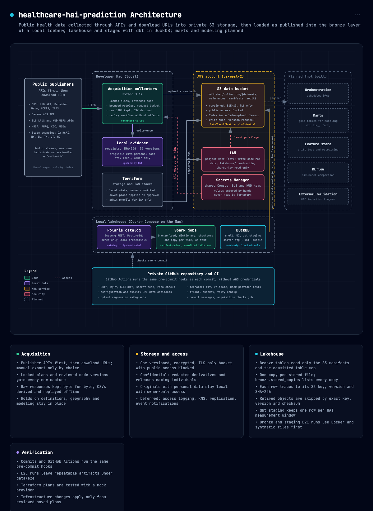

# healthcare-hai-prediction

Predicting hospital healthcare-associated infection rates from public CMS, Census, BLS and state data, built as a reproducible data engineering project on AWS.

Hospital-acquired infection prediction research for a data engineer. This fresh
repository builds on the capstone concept, not its implementation. Same-period
prediction is primary; forecasting is a later extension. Acquisition and S3
storage precede comprehensive schema review and tutorial drafting. Availability
does not establish clinical validity or model eligibility.

## Table of Contents

- [Security](#security)
- [Background](#background)
- [Install](#install)
- [Usage](#usage)
- [Architecture](#architecture)
- [Data](#data)
- [Quality Checks](#quality-checks)
- [Deploy and Teardown](#deploy-and-teardown)
- [Repository Layout](#repository-layout)
- [Limitations](#limitations)
- [Contributing](#contributing)
- [License](#license)

## Security

Deployment configuration is Internal; credentials are Restricted and never
belong in tracked files. Settings come only from the ignored `.env`, described
by `.env.example`. API keys live in AWS Secrets Manager and are read only at run
time (see [Install](#install)). Every commit is scanned for secrets, credential
files and data files (see [Quality Checks](#quality-checks)). Report a suspected
secret or personal value in this repository to the repository owner privately.

## Background

The project asks whether a hospital's infection score can be predicted from
same-period public measures and why a simpler earlier model explained little
of the variation. Approved collection is complete and its code is committed
(`3af1abb`); acquisition closeout is pending the final publisher redownload (run 3)
and confirmed disposal of personal originals. Public sources are collected
through publisher APIs first, then download URLs, into private versioned S3
storage with a receipt, hash and version readback for every object. The bronze
layer of a local Apache Iceberg lakehouse then holds one copy of every stored data
file as published, with each row traced to its S3 object version and checksum. It
also lists every other stored copy. All 330 mapped tables are loaded and checked; a
table whose files were all removed for privacy left the map. A dbt staging layer in DuckDB
reads the HAI, cost report, IPPS, occupational-mix, Provider of Services, Hospital General
Information, ownership, Medicare inpatient, HHS hospital capacity, ONC Promoting Interoperability and Care Compare
process and patient-experience tables. It keeps one row
per HAI and Care Compare measurement window, one row per hospital cost report, one Provider of
Services row per hospital and snapshot and one case-mix index per hospital and payment-rule year.
A hospital-year spine lines each hospital and calendar-year HAI window up with the Provider of
Services snapshot and the case-mix index from before the window. It also flags the model population.
Modeling and serving come later. The [Architecture](#architecture)
diagram shows what is built and what is planned.

## Install

Prerequisites: macOS on Apple silicon or Linux AMD64, Python 3.12, Git,
Terraform 1.16.1 and AWS CLI v2. Node.js 18 or later and Google Chrome render the
architecture diagram.
The lakehouse runs in Docker Desktop (32 GiB of memory on the development Mac in
October 2026). Every job launch computes one resource plan after the catalog services
start. Its container limit is the smaller of Docker's total minus running containers'
use minus 8 GiB headroom and the Mac's free, file-backed and purgeable memory minus
2 GiB. The Mac cap is skipped once Docker's VM holds its full allocation.
A container budget below 4 GiB stops the launch. DuckDB receives 80% of the container
budget, rounded down to whole GB, to leave room for allocations outside its buffer
limit. The 4 GiB floor applies to the container, so the engine allowance is smaller.
This reserve does not guarantee that a workload cannot run out of memory.

Spark retains its heap calculation: the smaller of the container budget divided by
1.10 and the budget minus 384 MiB, rounded down to whole GiB. Job parallelism uses
the smaller positive CPU count from `sysctl -n hw.ncpu` and Docker. The same count
sets Spark workers, lakehouse dbt model concurrency and DuckDB engine threads.
Fixture dbt model concurrency and the lint target stay at one for deterministic checks.
`scripts/lakehouse/memory_budget.py --launch-json` shows the complete plan.
The query, UI, dbt, Spark and staging verification launch paths all apply that plan;
job containers use `--no-deps` so dependencies cannot start after the measurement.
The analytics SQL settings are read-only Compose mounts and need no image rebuild.

When Polaris or PostgreSQL starts, `scripts/lakehouse/catalog.py` gives it a
container limit of 25% or 10% of the available budget (at least 1 GiB or 256 MiB).
Those limits stay fixed for that container's lifetime. A service-derived job limit
in the private Compose env file lets catalog-only commands render inactive profiles;
every job launcher overrides it with its fresh plan. Use the launch scripts to run jobs.
Close containers and apps you no longer use before a heavy run.

Run the non-Docker resource contracts with
`.venv/bin/python -m scripts.lakehouse.run_resource_checks`.
The artifact under `data/e2e/resource_limits/` records synthetic resource readings,
repeated CLI results and configuration checks. It does not prove live container limits;
verify those through Docker inspection and engine settings before declaring runtime
resource conformance complete.

Run from this repository's root with its existing Python 3.12 `.venv`.
Dependencies are shared across development and production in `requirements.txt`;
a requirement used only as a command carries `# tool: <use>` and one imported by
name carries `# dynamic: <where>`, so the dependency check reads them correctly.
Gitleaks, TFLint and trivy are installed only in ignored `.tools/`; versions and
publisher SHA-256 values are pinned in `config/quality_tools.json`. The markdownlint
hook's `markdownlint-cli2` is installed into `.tools/markdownlint-cli2` with `npm ci`
from the lockfile in `scripts/quality/markdownlint/`, which pins each package's
integrity hash; it needs Node.js 22 or later. The `sqlfluff` hook's SQLFluff and
its dbt templater are installed into `.tools/sqlfluff` from the hash-pinned
`scripts/quality/sqlfluff/requirements.txt`; the same command installs the dbt
packages from `dbt/package-lock.yml` into the ignored `data/analytics/dbt/dbt_packages`. The schema-review tools in
`scripts/review/` need the hash-pinned packages in `requirements-review.txt`,
installed into the ignored `.review_dependencies/` (Apple silicon only); the file's
header gives the command.

```sh
python3.12 -m venv .venv
.venv/bin/python -m pip install -r requirements.txt
.venv/bin/python scripts/quality/install_tools.py
.venv/bin/python -m scripts.quality.install_markdownlint
.venv/bin/python -m scripts.quality.install_sqlfluff
PRE_COMMIT_HOME="$PWD/.tools/pre_commit_cache" .venv/bin/python -m pre_commit install
cp .env.example .env
```

Fill every value in `.env`; the file stays out of Git. `AWS_PROFILE` is the
project profile, named `<PROJECT_NAME>_<ENVIRONMENT>` after its same-named IAM
user. IAM changes use a separate administrator profile that is never stored in
`.env`.

The lakehouse runs in Docker Compose (`docker-compose.yaml`):

- PostgreSQL and Apache Polaris 1.8.0 use digest-pinned images.
- The Spark 4.1.2 (Iceberg 1.11.0) and DuckDB 1.5.6 images are built from `services/`, with their Python packages hash-pinned.

The first catalog command pulls and builds them:

```sh
.venv/bin/python -m scripts.lakehouse.catalog up
```

`up` is idempotent. On first use it generates the catalog credentials into the ignored, owner-only
`data/lakehouse/secrets/` and never prints them. It creates the `hai_lakehouse` catalog, limited to `lakehouse/` in the
project bucket. `down` stops the containers and keeps the catalog database.

The native installer supports macOS ARM64 and Linux AMD64. Repeating a verified
installation preserves bytes and modification times; an unexpected existing
binary is rejected rather than overwritten. `--archive-directory` supports
offline installation from the exact pinned release filenames. Do not replace
the shared system tools to satisfy this project.

Named manual steps. These are the only setup steps no script performs:

1. **API keys.** Request the Census and BLS API keys from their publishers and
   store each in AWS Secrets Manager, in the configured region, as a secret named
   `census_api_key` or `bls_api_key` holding JSON with one field, `api_key`.
   The keys are shared by several projects, so they are created by hand outside
   Terraform. Store the HUD USPS crosswalk token separately as `hud_api_key`,
   in the same JSON shape with the token alone in `api_key` (no `Bearer`
   prefix; the collector adds the header). The IAM
   configuration grants read access to these three names and never reads a
   value; each permission update requires a reviewed saved plan before apply.
2. **Administrator profile.** Configure an AWS CLI profile with IAM permissions
   for the IAM stack. It is passed on the command line, never stored in `.env`.

## Usage

Run the local CI, which the pre-commit hooks and GitHub Actions also run, without AWS credentials:

```sh
env PYTHON_BIN="$PWD/.venv/bin/python" \
  TF_PLUGIN_CACHE_DIR="$PWD/infra/.terraform/providers" \
  /bin/bash scripts/run_ci.sh
```

Each CI run retains configuration evidence under `data/e2e/configuration/` and
quality evidence under `data/e2e/quality/`. E2E reports include source hashes,
expected and observed process outcomes, repeat commands and tested limits.
GitHub Actions retains these synthetic artifacts for 14 days. Local TFLint
needs permission to start its bundled plugin; a sandbox denial is a blocked
check, not a passing result.

The E2E runners can also run on their own; each needs a new output directory:

```sh
.venv/bin/python -m scripts.infrastructure.run_e2e --output-directory <new_directory>
.venv/bin/python -m scripts.quality.run_e2e --output-directory <new_directory>
.venv/bin/python -m scripts.quality.run_checks_e2e
.venv/bin/python -m scripts.quality.run_documentation_review_e2e
```

The lakehouse jobs run in the Spark container. The bronze E2E uses a throwaway local catalog and synthetic files, never
S3. Each load reads only the S3 manifests and the committed table map (`config/lakehouse/bronze_tables.json`), loads one
copy of each stored file (the smallest object key), lists every copy in `bronze.stored_copies`, replaces each object in
its own commit, prunes objects a table no longer selects, rebuilds the table's data dictionary and writes a counts-only
report. A corrected manifest replaces the manifest it names as superseded; tables taken out of the map are listed in
`config/lakehouse/removed_tables.json` and dropped with `--drop-removed`:

```sh
.venv/bin/python -m scripts.lakehouse.catalog job bronze_e2e        # report: data/e2e/bronze/
.venv/bin/python -m scripts.lakehouse.catalog job bronze -- --group hai           # or --tables a,b; report: data/e2e/bronze_load/
.venv/bin/python -m scripts.lakehouse.catalog job bronze -- --tables a,b --copies-only   # list copies, prune, verify
.venv/bin/python -m scripts.lakehouse.catalog job bronze -- --drop-removed       # drop tables in removed_tables.json
.venv/bin/python -m scripts.lakehouse.catalog job dictionary -- --tables a,b      # rebuild bronze_dictionary tables
.venv/bin/python -m scripts.lakehouse.care_compare_tables           # regenerate the care_compare group (read-only S3)
.venv/bin/python -m scripts.lakehouse.retired_objects --collection <publisher/collection>   # rebuild the retired list
scripts/lakehouse/query.sh                                          # DuckDB shell, bronze attached read-only
scripts/lakehouse/ui.sh                                             # DuckDB UI at http://localhost:4213
```

The dbt staging layer (`dbt/`, dbt-core with dbt-duckdb in the analytics image) reads bronze read-only. Its E2E builds
the models on synthetic fixtures, including cases that must fail one named test, then on the real bronze tables twice,
and reconciles each staging table with bronze. Where a text file and a workbook hold the same IPPS or occupational-mix
table, staging reads the text file and drops only the workbook sheets that a selected text file of the same release
matches row for row; every other sheet stays selected (`stg_bronze__sheet_selection`). `scripts.lakehouse.ipps_file_labels` regenerates the IPPS and
occupational-mix label and twin seeds from the S3 manifests; `--check` confirms the committed seeds. `int_pos_hospital_snapshots`
types the Provider of Services hospital rows; each file is dated by the catalog coverage in `dbt/seeds/pos_file_periods.csv`,
which `scripts.lakehouse.pos_file_periods` rebuilds from the S3 manifests and the local acquisition job plans. The case-mix index
models read the unadjusted CMI by exact header name (`dbt/seeds/cmi_layout_columns.csv`), keep the transfer-adjusted CMI in its
own column and choose one CMI per hospital and rule year from the year's best rule stage; disagreeing files are held in
`int_cmi_holds`. `int_hospital_spine` has one row per hospital and calendar-year HAI window, as of the window start: the
Provider of Services snapshot that ends in the 12 months before the window and the CMI of the fiscal year that ends before
it (`int_cmi_hospital_data_years`), with the primary and sensitivity population flags. The Care Compare timely and effective
care, maternal health and HCAHPS tables get the same window models as HAI (`int_cc_*_windows`, holds in
`int_cc_window_holds`); `int_registry_measure_windows` carries each registry measure of those families by the exact measure ID
in `dbt/seeds/registry_measure_sources.csv`. `int_hgi_hospital_releases` types Hospital General Information per file.
`int_cost_reports` has one row per hospital cost report, in the federal fiscal year in which its period starts, with the
number of reports of its CCN in that year; `int_cost_report_measures` computes each registry cost-report measure by the
columns and rule in `dbt/seeds/cost_report_measures.csv` and gives null for a zero or missing denominator. The IPPS
impact files from FY 2001 are read by exact header name (`dbt/seeds/impact_layout_columns.csv`): `int_impact_hospital_values`
has one row per release, hospital and field. `int_impact_measures` carries the registry measures of source CMS_IPPS. The
Medicare inpatient provider and DRG summaries are typed per file, with the data and release years from the file name
(`int_mup_providers`, `int_mup_drg_discharges`); a blank, suppressed cell is null. `int_mup_measures` computes the registry
measures of sources CMS-MUP-PROVIDER and CMS_MEDICARE_PROVIDER by the fields and rule in `dbt/seeds/mup_measures.csv`. The
owner, enrollment and change-of-ownership files are typed per release (`int_hospital_owner_rows`,
`int_hospital_enrollment_rows`, `int_change_of_ownership_rows`). Each file is dated by the publisher's catalog period in
`dbt/seeds/ownership_release_periods.csv`, which `scripts.lakehouse.ownership_release_periods` rebuilds from the S3
manifests and the local capture receipts. An owner flag a release's layout lacks (private equity and REIT before
April 2025) is null; `dbt/seeds/ownership_measures.csv` names the columns each registry control uses. The HHS weekly
hospital capacity rows are typed per hospital and week (`int_hhs_capacity_weeks`): a count of 1 to 3, published as
-999999, is null and listed in `suppressed_fields`; any other negative value is null and listed in `negative_fields`.
The ONC Promoting Interoperability to certified-product linkage and
the older 2011 to 2017 EHR incentive attestations are typed apart (`int_onc_chpl_linkage_rows`,
`int_onc_attestation_rows`). `dbt/seeds/hhs_onc_measures.csv` maps the registry controls; the HHS field names the
source truncates are resolved through the stored `columns.json`.

Occupational-mix surveys are typed per file, sheet and source row (`int_occmix_survey_rows`). Exact headers distinguish
survey records from CBSA and S-3 tables; the layout inventory retains every selected file and sheet. Survey dates come
from FROM and TO, including workbook ISO dates. Payment-rule years stay separate. Deleted records, invalid
identifiers or periods and duplicate provider-period rows remain visible with a hold and no derived values.
`dbt/seeds/occmix_measures.csv` maps all six S03 registry controls: RN paid hours, the RN, combined LPN/LVN plus
surgical-technologist and NAORAT paid-hour shares and RN salary per paid hour. Missing values and nonpositive
denominators give null. C043 stays unavailable: paid hours cannot substitute for direct-care worked hours per patient-day.
Comma-grouped numbers are parsed only when their grouping is valid. Dots, dashes and blanks remain null.
Source revisions remain separate; hospital-window alignment, publication timing and model eligibility are pending.

The geography sources are typed at their own grain. HUD ZIP-to-county rows carry the USPS quarter their capture
receipt records (`int_hud_zip_county_quarters`), with each address ratio kept separately; the 47 rows whose code is
not a county are held apart (`int_hud_zip_county_holds`). County adjacency covers the 2010 and 2023 to 2026 files with
self-links and islands flagged (`int_county_adjacency_edges`). Rural-Urban Continuum Codes (2013, 2023) and Rural-Urban
Commuting Area codes (2010, 2020; tracts and ZIP codes) stay text categories (`int_rucc_county_codes`,
`int_ruca_codes`). Hospital service area counts keep their suppression marks as flags (`int_hsa_zip_cases`). County
codes are 5-character text; Connecticut is flagged, not removed. `dbt/seeds/geography_file_periods.csv`, generated by
`scripts/lakehouse/geography_file_periods.py`, dates every file: HUD and service-area files from their acquisition
records, RUCC, RUCA and adjacency files by a reviewed vintage that is not a publication date.
`dbt/seeds/geography_measures.csv` maps the eight registry controls of these families. Weights, graph rules and
hospital-window alignment are pending.

ACS 5-year values for 2010 to 2024 come from the data.census.gov exports and, for the detailed tables from 2018, the
summary files (`int_acs_county_values`, one row per county, vintage and concept). ACS column codes change meaning between
vintages, so `dbt/seeds/acs_variable_map.csv` names, per concept and vintage, the column and the exact label it must carry;
a test fails when a file's label differs. A wording change of meaning holds the vintage instead of mixing it in; so do
the subject-table units that changed from percents to counts in 2017. Missing marks and sentinels stay as tokens; a capped
median keeps its cap and a flag. SVI's seven editions are staged long under each edition's own field names
(`int_svi_county_values`), with -999 kept as a token. The ACS file vintage and the SVI edition come from
`dbt/seeds/geography_file_periods.csv`. `dbt/seeds/acs_svi_measures.csv` maps the 44 S18 and S19 controls to ACS concepts
and SVI fields; staging picks no source between them.

SAIPE county estimates for 1989 to 2024 are cut from the fixed-width files at the positions every year's layout documents
(`int_saipe_county_estimates`): poverty counts and percents with 90% bounds and median household income in nominal dollars.
SAHIE county rows for 2006 to 2024 keep their published age, race, sex and income groups (`int_sahie_county_rows`); a test
checks that each file's preamble defines code 0 as under 65, all races, both sexes and all incomes, the group the registry
names. BLS LAUS county series (`int_bls_county_series`) keep months and annual averages apart, with footnote codes and the
capture date as the revision vintage. `.` and `-` stay as missing marks. `dbt/seeds/income_labor_measures.csv` maps the
SAIPE, SAHIE and BLS registry controls.

PLACES county values keep their release, data year, measure and crude or age-adjusted type (`int_places_county_values`);
`is_all_states` marks the measure-years whose county rows cover all 50 states and DC, the only ones the approved rule
allows. The 2020 release has no county codes and is not typed. Medicare Geographic Variation county values are staged
long for the All age level with `*` kept as a token (`int_gv_county_values`). WONDER deaths and crude rates keep their
database, bridged race (1999 to 2020) or single race (2018 to 2024), with their Suppressed, Unreliable, Missing and Not
Available marks (`int_wonder_county_deaths`); the 2024 rows repeated identically in the shorter single-race export are
held. `dbt/seeds/county_health_measures.csv` maps the 56 registry controls of these sources.

CMS Mapping Medicare Disparities prevalence (`int_mmd_prevalence`) is staged per control, year and county or state for its
one filter set. Each row takes its control from the reviewed condition label map (`dbt/seeds/mmd_conditions.csv`, written by
`scripts/lakehouse/mmd_conditions.py` from the pinned collection plans), so the earlier acute myocardial infarction captures
are mapped too. Zeros keep a possible-suppression flag and county rows without a name are flagged as unknown counties.
C258.78 is a state rate per 100,000. All 82 MMD controls stay held for definition. HRSA primary-care HPSA components
(`int_hpsa_components`) and MUA and MUP components (`int_mua_components`) keep each designation's type, status, score and
dates as published at the capture, with `XXXXX` county codes kept as tokens; rows repeated identically in the file are held.
The period seed dates each MMD file by the year in its name and the HPSA and MUA files by their capture date, which the
models carry as `capture_date`. The Federal Register HPSA workbooks stay in bronze. `dbt/seeds/shortage_measures.csv`
maps the 85 registry controls of these sources.

Validation outcomes (group D) are staged as Care Compare windows with the same latest-release rule: unplanned hospital
visits (`int_cc_unplanned_visits_windows`), complications and deaths (`int_cc_complications_deaths_windows`) and the
Hospital Readmissions Reduction Program by condition (`int_cc_hrrp_windows`). Every published measure ID is kept;
`dbt/seeds/validation_measures.csv` maps only the exact IDs the registry names (C289 to C291 and their children), so
renamed IDs such as `OP-32` and the PSI-90 and PSI-13 controls (E038, E039), which name no published ID, stay unmapped
(`int_validation_measure_windows`). `Not Available`, `Not Applicable`, `N/A` and `Too Few to Report` stay text. These
tables are for validation only; none is a predictor.

The HAC Reduction Program (`int_hac_program_years`) and Hospital VBP Total Performance Score (`int_vbp_program_years`)
are staged per hospital and program fiscal year from the latest release, so a revised file replaces the original. The
HAC model keeps the payment reduction, Total HAC Score, PSI-90 and domain z-scores; the HAI SIRs that file republishes
are not staged, so the outcome comes only from the HAI windows. Three older VBP files publish no fiscal year and take a
reviewed year from `dbt/seeds/vbp_file_fiscal_years.csv`, whose evidence is the published national average score. The
registry controls (C285 to C288) are in `int_validation_program_values`; all are comparison_only or exclude_primary.

The dbt packages
(dbt-project-evaluator 1.4.0 and its dbt_utils 1.4.1) are declared in `dbt/packages.yml` and pinned by version in `dbt/package-lock.yml`; dbt Hub
publishes no content checksum. They install outside the read-only project: `scripts/lakehouse/dbt.sh deps` installs them in the
container. The staging E2E installs them before it builds. dbt-project-evaluator is off in every other run and runs
only on request, on the in-memory `lint` target with no catalog; its findings are warnings:

```sh
.venv/bin/python -m scripts.lakehouse.run_staging_e2e              # fixtures; --real adds the real tables; report: data/e2e/staging/
scripts/lakehouse/dbt.sh deps                                       # install the locked dbt packages (once)
scripts/lakehouse/dbt.sh build                                      # dbt on the real bronze tables
.venv/bin/python -m scripts.lakehouse.run_project_evaluator         # dbt-project-evaluator; report: data/e2e/dbt_evaluator/
.venv/bin/python -m scripts.lakehouse.ipps_file_labels --check      # seeds match the S3 manifests (read-only S3)
.venv/bin/python -m scripts.lakehouse.pos_file_periods --check      # POS periods match the manifests and job plans
.venv/bin/python -m scripts.lakehouse.ownership_release_periods --check   # ownership periods match the manifests and receipts
.venv/bin/python -m scripts.lakehouse.geography_file_periods --check      # geography periods match the manifests and records
.venv/bin/python -m scripts.lakehouse.mmd_conditions --check             # MMD condition map matches the pinned plans
```

Load large groups in batches of about 20 to 40 tables: each job stops after 1 hour (`COMPOSE_TIMEOUT` in
`scripts/lakehouse/catalog.py`). A rerun of the same tables ends in the same state.

Before every commit, stage the intended files by name, then draft, complete and
retain the ignored local documentation review record (see [Quality Checks](#quality-checks)).

## Architecture



The diagram source is `docs/architecture/architecture.json`, drawn with
[Archify](https://github.com/tt-a1i/archify) v3.0.1. Each component cites the
lines of code or configuration it was checked against, at the commit named in
the JSON. Its `finalize` command validates the JSON, writes
`docs/architecture/architecture.html` and checks it in Chrome; the PNG is
rendered from the HTML with headless Chrome. Planned components are listed in
the "Planned (not built)" card. With Archify unpacked at `<archify>`:

```sh
ARCHIFY_UPDATE_CHECK_DISABLED=1 node <archify>/bin/archify.mjs finalize architecture \
  docs/architecture/architecture.json docs/architecture/architecture.html --repo-root . --quality showcase
"/Applications/Google Chrome.app/Contents/MacOS/Google Chrome" --headless=new --hide-scrollbars \
  --window-size=1600,1120 --virtual-time-budget=5000 \
  --screenshot=docs/architecture/architecture.png "file://$PWD/docs/architecture/architecture.html"
```

`finalize` also writes receipt files beside the HTML; keep them out of Git.

## Data

Published hospital-level datasets are public reference data subject to their
source terms. Public availability does not remove personal-data safeguards.
Any specifically approved source containing personal names or contact details
is classified as Confidential and requires a documented ingestion exception.

For the approved HCAI exception, the untouched download stays local with
owner-only access. Only the privacy-filtered derivative and non-personal
references or provenance may enter the project's private S3 storage. The
derivative remains under privacy and modeling review; redaction does not
establish formal anonymization or clinical validity. Raw retention duration
remains unresolved. FileVault was verified at commit `a1b758a`; that host check
does not establish compliance or resolve retention requirements.

The data bucket carries its own `DataClassification` tag of Confidential
(project decision, commit `c143cbc`). Redacted derivatives are not formally
anonymized. Hospital chief executives in HCAI annual financial files and state
officials' work contacts in a CMS contacts table are treated as Confidential:
originals stay local and only redacted copies belong in S3. The initial 218
Excel/contact versions were removed before commit `f9ef312`. Redacted replacements for
75 further versions are stored; those originals were deleted and verified before
that commit. Retirement records cover all 293 removed versions, storage
reconciliation passed and the temporary deletion grant was removed.
Operational evidence stays in ignored local
folders; this status does not clear privacy or modeling holds. The project no
longer uses the HRSA Area Health Resources Files: their license limits sharing
the data with third parties, so the five measures built on them were dropped and
all 399 stored versions were deleted and verified before commit `f9ef312`.

Tests use generic synthetic data. Real personal values must never appear in
fixtures, logs, tutorials, published artifacts or commits. Acquisition inputs,
operational evidence and the detailed exception record remain untracked.

The explicitly approved live S3 verification tool is the sole opt-in exception
to synthetic-only verification. Normal CI does not run it or contact AWS.

**Bronze lakehouse.** Bronze loads one copy of every stored data file as published, every value as text:

- CSV files keep their columns.
- Text files keep one row per line.
- Excel files keep one row per sheet row.
- PDFs and Word documents keep their table rows and text.

Every row carries its source, snapshot, S3 key, version and SHA-256. `bronze.stored_copies` lists every stored copy of
each file with its lineage and whether it is loaded or retired. Each table's `bronze_dictionary` entry lists its
columns with counts and the publisher's description or published type where a stored dictionary gives one. CMS Care
Compare dictionaries give types only. Bronze does not load:

- objects removed from S3, which the manifests still list (`config/lakehouse/retired_objects.json`, keys, versions and
  checksums only): the privacy deletion and, on Oct 4 2026, 2,193 byte-identical duplicate versions, each with a kept
  twin verified first;
- other copies of a file already loaded, which `bronze.stored_copies` lists;
- a Care Compare contacts file that names state staff;
- audit copies, receipts and Office package parts.

Two HRSA detail files, stored under the dictionary role, have corrected manifests in S3 that give them the data role
(`config/acquisition/manifest_corrections.json`, written by `scripts.acquisition.correct_manifest_roles`); the original
manifests stay unchanged. Open gaps are tracked in the local issue register.

[docs/data_collection.md](docs/data_collection.md) explains how every source was
collected and how to recheck it, including the named manual data steps: terms
acceptance, API accounts and the browser downloads (CMS Mapping Medicare
Disparities exports, Census table exports, CDC WONDER county mortality exports
and the 2010–2020 HUD ZIP-to-county workbooks). Its commands need the acquisition code in `scripts/acquisition/`
and `config/acquisition/`, tracked in Git since commit `3af1abb`. Registry revision 2 preserves exact legacy fingerprints for historic replay;
its private legacy archive stays outside Git. The bounded publisher redownload (run 3) remains the final verification.

## Quality Checks

CI checks Ruff formatting and security rules, MyPy, outgoing-source secret
scanning, repository checks, configuration and quality E2E, retained regression
safeguards, Terraform mock tests, TFLint, Checkov and `trivy config` (its
embedded checks only, run offline). Pre-commit scans the actual staged index,
including changes hidden by a clean working copy, before local CI. The source
scan excludes ignored acquisition data; neither scan sends files to an external
service. Secret values and matching source fragments are omitted from scanner
diagnostics.

Pre-commit (`pre-commit` and `commit-msg` stages) and `scripts/run_ci.sh`
enforce these repository rules at the pinned versions. The full set
(`.venv/bin/pre-commit run --all-files --hook-stage manual`) runs before a
release or push. GitHub CI runs that same command on every push and pull
request. In the full set gitleaks scans every outgoing source file instead of
the staged index. The acquisition checks run in their own CI job and through
their hook only when acquisition files change; run them directly before a release
with `bash scripts/acquisition/run_checks.sh`.

- **Secrets and credential files:** gitleaks scans the staged index; `.env`
  (but not `.env.example`), Terraform state and saved plans, keys and cloud
  credential files are blocked.
- **Data files:** `.csv`, `.tsv`, `.parquet`, `.xlsx`, `.xls`, `.jsonl`,
  `.ndjson`, `.avro`, `.db` and `.sqlite` files are allowed only in
  `tests/fixtures/` for synthetic samples and in `dbt/seeds/` for the reviewed
  dbt seeds (file labels and checksums from the S3 manifests, no source values). Any file over 5 MB is blocked
  unless Git LFS stores it. Acquired data stays in S3 and ignored local folders.
  Git LFS stores two acquisition config files over the limit,
  `config/acquisition/source_registry.json` and
  `config/acquisition/planning_v1/acquisition_plans_v1.json` (listed in
  `.gitattributes`); a clone needs `git lfs install` to fetch them.
- **Privacy scan:** every tracked or untracked non-ignored file, not only the
  diff, is scanned for home-directory and machine temporary paths, email
  addresses outside reserved domains (`example.invalid`, `.test`), phone
  numbers, AWS account IDs (including those in ARNs) and values of identifying keys in `.env`.
  Findings give file, line and type, never the value. Files that cannot be read
  as text are listed as unreviewed; inspect them before publishing. Intentional
  values go in `.privacy_allowlist` as `<type> <path glob> -- <reason>`,
  matched by type and path only; an entry without a reason is itself a finding.
  The synthetic account IDs in the Terraform, infrastructure and configuration
  tests are listed there. Before publishing, also scan ignored and hidden files
  with `.venv/bin/python -m scripts.quality.repo_checks privacy-scan --all`
  (`--warn` reports without failing).
- **Writing check:** the prose of every tracked or untracked non-ignored
  Markdown file (front matter, code spans and blocks, URLs and `tests/fixtures/`
  excluded) is checked for a comma before a final "and", "or" or "nor" and for
  ISO dates in prose, which are written as `Sep 30 2026`. It also blocks the time-bound
  words `currently`, `recently`, `soon`, `eventually`, `as of this writing`,
  `at present`, `in the future` and `for now`. Files declared with
  `--articles <glob>` are also checked for em dashes. Exceptions go in
  `.writing_allowlist` as `<type> <path glob> -- <reason>`; an entry without a
  reason is itself a finding. It blocks: the existing prose was corrected before
  each rule was enabled. Run it with
  `.venv/bin/python -m scripts.quality.repo_checks writing-check` (`--warn`
  reports without failing).
- **Markdown syntax:** `markdownlint-cli2` checks every staged Markdown file
  outside `data/` against the Conventional Docs baseline in
  `.markdownlint-cli2.jsonc` (dash bullets, ATX headings, sequential numbered
  lists, a language on every code fence). It blocks: a whole-project run was
  clean when it was added.
- **Front matter:** every Markdown document outside `data/`, except READMEs,
  well-known files and `.github/` templates, starts with YAML front matter that
  parses and holds `title` (equal to the H1), a `description` of at most 120
  characters and `last_updated` as `YYYY-MM-DD`. It uses PyYAML, pinned in
  `requirements.txt`. It blocks: a whole-project run was clean when it was added.
- **Commit messages:** Conventional Commits and no AI attribution, checked in
  the full message by the `commit-msg` hook and, in GitHub Actions, for every
  pushed commit. AI credit and agent-session lines are rejected; human
  co-authors and factual tool mentions are allowed. Detection uses an explicit
  agent/vendor list, so new forms need a failing sample before the check is
  extended. Review pull request text separately; a Git hook cannot read it.
- **Docs match the code:** every environment variable the code reads is listed
  in `.env.example` and every variable listed there is read by code, a script,
  a workflow or a template. Local commits require an ignored `.documentation_review.json`, a per-document
  review outcome bound to the staged snapshot. Draft it with
  `.venv/bin/python -m scripts.quality.documentation_review prepare --reviewer <name> --reviewed-at <UTC>`
  after staging, review every document and fill each outcome and note locally. Never stage
  this record. The local hook validates its freshness against the index and rejects
  tracked evidence. GitHub Actions checks that the record is untracked and runs
  synthetic hook tests; it cannot verify the private local review itself.
- **Removed names:** a name the staged change removes is no longer referenced:
  a deleted script, a command-line flag, an environment variable, a top-level
  Python function or class, a config key with `_`, `-` or camelCase, a Terraform
  variable, output, module, resource or data source, a deleted dbt model or a
  dependency that leaves every requirements file. Code names are searched in
  code and config and in the code spans and fences of Markdown, not in prose;
  `CHANGELOG.md` is history and is not searched. GitHub Actions runs the same
  check over every pushed range. A reference that must stay goes in
  `.cleanup_allowlist` as `<kind> <path glob> -- <reason>`; an entry without a
  reason is itself a finding. It blocks: a replay over every earlier commit
  found only deliberate references (a removed config key that the bronze loader
  refuses by name).
- **Unused code, dependencies and files:** vulture 2.16 (60%
  confidence) reports functions, classes and variables nothing uses; deptry
  0.25.1 reports requirements nothing imports and imports no requirements file
  declares; `orphan-files` reports tracked files no other file names by path,
  file name, folder or import (including `python -m`); tflint (`terraform_unused_declarations`, each
  folder that holds a tracked `.tf` file) reports unused Terraform declarations. vulture and deptry are pinned
  in `requirements.txt`. They block. deptry checks each runtime on its
  own code and requirements, as `config/quality/dependency_runtimes.json` maps
  them: the host (every file no other runtime claims), the review tools, the
  Spark jobs, the analytics image and the SQLFluff tools (no project code). A
  package a runtime gets outside pip, such as PySpark, is listed there with its
  source. A hash-locked requirements file also pins transitive packages, so only
  its missing imports are reported; a file two runtimes share reports a package
  as unused only when neither imports it. Exceptions go in `.cleanup_allowlist` with a
  reason, under the kinds `unused-code`, `unused-dependencies`, `orphan` and
  `terraform-unused`; dbt's folder-loaded models and macros are listed there.
  A name used in a way vulture cannot see (a parser callback, a pytest autouse
  fixture, a field written out through `dataclasses.asdict`) goes in
  `scripts/quality/vulture_whitelist.py`, one name per entry with its reason, so
  the rest of its file is still checked. The whitelist also keeps one dead WONDER
  constant until the next WONDER code version, because its file is in the
  approved code hashes of 9 collectors. Run one check with
  `.venv/bin/python -m scripts.quality.repo_checks unused-code` (`--warn`
  reports without failing).
- **Lint settings:** Ruff keeps rule sets `E`, `F`, `I`, `B`, `UP`, `S`, `SIM`
  and `T20` at line length 160 with no ignore or exclude settings; MyPy keeps
  `--check-untyped-defs` and `--disallow-untyped-defs`. The only allowed
  suppression is Ruff `S603` in `scripts/process.py`, the one process launcher;
  other scripts start programs through it and run as modules
  (`.venv/bin/python -m scripts.quality.scan_secrets`). Tests use
  `tests/support.py` `check()` instead of `assert`.

**Acquisition checks** (`bash scripts/acquisition/run_checks.sh`) run Ruff, MyPy,
registry validation, the acquisition regression tests and every offline E2E
suite twice, with a 90% coverage gate that also counts collector command lines
run as child processes. They take 12–14 minutes (up to 29 in CI), so they run only
when acquisition code, configuration or their dependencies change: through the
`acquisition-checks` pre-commit hook and in a separate GitHub Actions "Acquisition
Checks" job (30-minute limit, LFS checkout, pinned Terraform). The CI job uses the
hook's own path pattern through `scripts/acquisition/run_checks_ci.sh`, which also
matches the CI workflow; a manual run, the first push of a branch or rewritten
history runs every check. `bash scripts/acquisition/run_checks_ci_e2e.sh` tests
that gate. Each push to `main` gets its own CI run, so a newer push never cancels
the check of an earlier range. They need no AWS credentials and no
collected `data/`. Off macOS, the HUD workbook and WONDER suites substitute only the
macOS browser-download metadata (the "downloaded from" attribute and file creation
time); on a Mac the real reads run. When the private archive is absent (as in CI), the
registry-additions suite skips its single legacy-archive check and records the skip. The coverage gate leaves out
the tools in `scripts/acquisition/one_off/`, which ran once and are evidenced by their run records; a
gate test loads every committed collector plan through its contract; it needs the collected `data/`, so CI
skips it.

Each check has a bad and a good sample run through the real `pre-commit` entry
point (`scripts/quality/run_checks_e2e.py` and
`scripts/quality/run_documentation_review_e2e.py`); both run in local CI.
Every detection check was run on the whole repository before it was enabled,
with no false positives, so they block from the start. The writing check blocked
only after the existing prose was corrected. The unused code, dependency and file
checks blocked only after their findings were deleted or listed with a reason. There are no bypasses:
never use `SKIP=` or `git commit --no-verify`. If a check blocks a valid change,
fix the check or ask the repository owner.

## Deploy and Teardown

`scripts/infrastructure/terraform.sh` renders Terraform inputs from `.env`,
verifies the project identity and runs Terraform with the named profile. Apply
only a reviewed saved plan:

```sh
bash scripts/infrastructure/terraform.sh plan -out=<plan_file>
bash scripts/infrastructure/terraform.sh apply <plan_file>
bash scripts/infrastructure/terraform.sh --iam --admin-profile <administrator_profile> plan -out=<plan_file>
bash scripts/infrastructure/terraform.sh --iam --admin-profile <administrator_profile> apply <plan_file>
```

Terraform state stays local in each stack folder and is never committed.
Remote state protection remains deferred until the end of the project as
requested.

**Teardown.** The data bucket is the project's persistent store of immutable
source data, not a demo stack, so it has no destructive teardown switch
(project exception, commit `c143cbc`). `force_destroy` is false and
`prevent_destroy` is set; removing the bucket would need a separately reviewed
change that lifts both protections first. The bucket keeps its established name
rather than the `<project>-<component>-<environment>` pattern, because renaming
it would mean moving all stored data (project exception, commit `c143cbc`).

**Environments.** Both stacks tag resources with `Environment = dev`. A `prod`
environment and an `infra/modules/` layout are deferred until the next
infrastructure component is added (project decision, commit `c143cbc`).

**Lifecycle rules.** The bucket-wide rule, applied and read back from S3 at
commit `a1b758a`, aborts incomplete multipart uploads seven days after
initiation, with no expiration or transition of completed objects, historical
versions or delete markers. One exception covers only `lakehouse/`, where
Iceberg replaces and deletes its own table files: replaced versions there expire
30 days after they are replaced and orphaned delete markers are removed; current
lakehouse files and everything outside `lakehouse/` never expire (owner decision). Local mock-plan tests, source-shape checks and live
configuration readback pass. The seven-day scheduler itself has not been
observed in a timed test and no deliberately incomplete upload was created for
verification.

Pre-deployment inspection confirmed no existing lifecycle configuration. The
separately approved IAM plan added only bucket-scoped
`s3:PutLifecycleConfiguration`; the approved storage plan created only the
cleanup rule. IAM administration was used only for the policy update, while
storage deployment used the project profile. This permission can change the
bucket's entire lifecycle configuration, so future changes still require full
plan review and preservation of existing rules. Private plans and live
verification evidence remain untracked under
`data/infrastructure/lifecycle_deployment/`.

**Deferred controls.** Apply the project's engineering requirements when
development reaches the relevant stage. Future requirements guide later work;
deferral does not mean a control is implemented. The following
acquisition-stage deferrals are approved for `aws_s3_bucket.data` only. Checkov
and trivy evidence retain each exception, resource and reason.

| Deferred control | Reason | Review trigger |
| --- | --- | --- |
| Event notifications (`CKV2_AWS_62`) | No event consumer exists. | Implementing an event consumer. |
| Cross-region replication (`CKV_AWS_144`) | Recovery objectives and a destination are not established. | Recovery design, before production. |
| KMS (`CKV_AWS_145`, trivy `AWS-0132`) | Acquisition uses SSE-S3/AES256. | Coordinated ingestion and IAM migration, before production. |
| Access logging (`CKV_AWS_18`, trivy `AWS-0089`) | Approved acquisition-stage deferral of a separate logging destination; request-audit gap accepted for this stage. | Before additional user or service access, production or newly approved sensitive-data use. |

Access logging was explicitly deferred at commit `a1b758a`. Acquisition
receipts establish pipeline provenance, not an independent record of every
bucket request. Review CloudTrail data events alongside server access logging
when a review trigger is reached. Server access logs are best-effort, not a
complete audit trail ([AWS documentation](https://docs.aws.amazon.com/AmazonS3/latest/userguide/ServerLogs.html)).

Existing AES256 encryption, private access, versioning and destruction
protection are preserved. Synthetic E2E checks verify that the four exceptions
do not suppress other resources or the versioning control. Passing static
checks with these exceptions does not establish that deferred controls exist.
No AWS changes implementing these four deferred controls have been applied.

## Repository Layout

- `infra/`: private, versioned S3 configuration; `infra/iam/`: scoped service policies.
- `scripts/process.py`: the one process launcher every script uses to start programs.
- `scripts/infrastructure/`: dotenv rendering, identity guards and configuration E2E.
- `scripts/quality/`: pinned tool installation, secret scanning, repository checks, documentation review and Terraform analysis.
- `scripts/run_ci.sh`: the local CI script; the `local_ci` hook runs it on every commit and in GitHub CI.
- `tests/`: retained pytest regression safeguards and their `check()` helper.
- `config/quality_tools.json`: pinned native tool versions and publisher hashes.
- `config/quality/dependency_runtimes.json`: each runtime's requirements files and code, for the dependency check.
- `docs/architecture/`: the architecture diagram source (`architecture.json`), the HTML that Archify renders from it and the PNG.
- `dbt/`, `.sqlfluff`: the dbt staging project (sources, staging and intermediate models, seeds, tests and the locked
  packages) and its SQL style.
- `scripts/review/`, `requirements-review.txt`: the schema-review tools and their hash-pinned packages.
- `docs/data_collection.md`: how the source data was collected and how to recheck it.
- `docs/issue_register.md`: the project's single issue register, kept local-only (Git-ignored).
- `docs/project_guide.md`: the project's target design with each section's build status, kept local-only (Git-ignored).
- `.github/`: the CI workflow and the pull request template.
- `scripts/lakehouse/`, `config/lakehouse/`: the catalog script, the bronze loader, file readers, dictionary and
  checksum jobs, the Care Compare, retired-object and IPPS label generators, the dbt runner, the dbt-project-evaluator
  runner and the bronze and staging E2E; the table map, the retired and removed lists and the reviewed label overrides.
- `services/`, `docker-compose.yaml`: the Polaris catalog, Spark job and DuckDB analytics containers.
- `scripts/acquisition/`, `config/acquisition/`: collectors, storage checks, E2E suites and their locked plans and
  registry. Committed at commit `3af1abb` with full documentation of the collection process
  at the end of the data collection stage; collected data and audit evidence stay in the ignored `data/` folder.
  `scripts/acquisition/one_off/` holds tools that ran once, such as queue builders and the privacy and duplicate
  deletions, moved there from `data/` on Oct 4 2026; their run records stay in `data/`.
  No tutorial files are added to this repository.

## Limitations

These checks are not deployment or clinical validation. The acquisition checks
run on synthetic inputs; a clean checkout cannot replay stored captures, which need
the ignored local originals and the private legacy registry archive.
Nothing in S3 is approved for modeling: definitions, geography and modeling
reviews remain open. Raw personal-data retention remains a separate unresolved
control. The deferred controls above are not implemented.

The lakehouse runs on one Mac against the project bucket; it is not a deployed service. Bronze holds raw text only and
loads one copy per stored file. Staging covers the HAI, cost report, IPPS, occupational-mix, Provider of Services, Hospital
General Information, ownership, Medicare inpatient, HHS capacity, ONC, Care Compare timely and effective care, maternal health and HCAHPS
tables, the geography tables (HUD ZIP-to-county, county adjacency, RUCC, RUCA and hospital service areas), the ACS and SVI
tables, SAIPE, SAHIE, BLS, PLACES, Medicare Geographic Variation, WONDER, MMD and the HRSA HPSA and MUA files. It types the
HAI and Care Compare windows, the geography files, the ACS, SVI, SAIPE, SAHIE, BLS, PLACES, geographic variation, WONDER
and MMD values, the HPSA and MUA designations, the group D validation windows (unplanned visits, complications and
deaths, readmissions reduction) and HAC Reduction and VBP program years, the occupational-mix surveys, the cost reports, the IPPS impact-file fields, the Medicare inpatient summaries, the owner, enrollment and change-of-ownership releases, the HHS capacity weeks, the ONC linkage and attestations, the Provider of Services hospital snapshots, Hospital General Information and the case-mix
index. The Medicare sepsis share counts only published DRG cells (11 discharges or more), so it can be low for small
hospitals; the Medicare chronic-condition shares start with data year 2017. Each change-of-ownership release lists
events back to 2016, so one event appears once per release until the alignment step chooses one. An enrollment or
change-of-ownership value with a suffix after the CCN is kept as published, with no CCN. Registry controls C001 and C040
name no HHS field, so the HHS columns are staged but not mapped to them. It also builds the hospital-year spine; the other tables pass through as published. No gold or model tables exist. The bronze and staging E2E runs use
Docker and are not part of the local CI script. The final publisher redownload (run 3) has its queue built and checked
offline. It has not run: its controls, independent review and the owner's approval are still to come.

## Contributing

Individual project; contributions are not accepted.

## License

All rights reserved.
